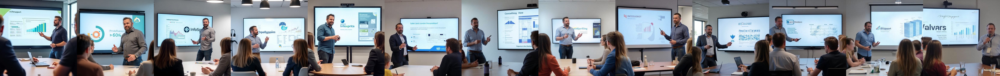

# AI-Up.Date

## AI-Generated Image Captioning & Training LoRa Workflow
This repository demonstrates the step-by-step process for training a LoRa (Low-Rank Adaptation), aimed at generating AI-rendered images of 'Tim Mahy'.

A LoRa differs from retraining/fine-tuning the existing model, and uses a complex process to inject information about the subject. For more info on LoRa, see: [LoRa: Low-Rank Adaptation of Large Language Models](https://arxiv.org/abs/2106.09685).

## Considerations:

#### - LoRa Naming
The name "JefPajot" was selected to avoid model biases associated with real names. This approach intends to reduce unintended associations that could influence the model's outputs.

There are two dominant schools of thought on the matter: 
* use a unique token that the model has zero knowledge of, so the model starts from scratch
* use a token that the model has seen before, e.g a lookalike celebrity; so the model can achieve better generality, at the risk of poisoning the output with the lookalike's features

#### - Face blurring

To protect privacy and maintain focus on the primary subject, we blurred non-subject faces in the training data. This measure also prevents potential model misinterpretations during training and reinforces responsible handling of personally identifiable visual data.

Originally only the resized images were blurred, as these were used for captioning and training. For the purpose of sharing the final outputs, the high-resolution images were separately blurred.

This however leads to an interesting issue, where outputs with the LoRa commonly feature people in the background with blurred faces. This means that the model now views blurred faces as a common feature of the subject. This is a potential issue that should be addressed, for example by faceswapping the blurred faces with generic faces. 


#### - Privacy

Training a model with a specific person's likeness raises privacy concerns. Tim Mahy is aware of these concerns and has given explicit consent for this project. The resulting LoRa is not intended for commercial use, and the generated images are not to be shared publicly without consent.

## Workflow

### 0) Image Collection
We began by sourcing high-quality images featuring varied backgrounds, focusing on clear subject visibility and center positioning. 
The selection process prioritized diversity in setting and appearance to ensure the model's adaptability to different scenarios.

Due to a lack of high resolution images, a separate set of images was taken in-person to supplement the dataset, these images offered less diversity.

These images are not shared, as they contain personal data.

### 1) Cropping
Images were cropped to a 1:1 ratio, attempting to center the subject to streamline model training.


### 2) Resizing
The model can be trained on either 512x512 or 1024x1024 images. We opted for the latter to enhance visual fidelity.
The high-resolution images were downsampled to 1024x1024 pixels using the LANCZOS filter for optimal fidelity during training.


### 3) Captioning
Detailed captions were generated via a custom MyGPT setup, leveraging the strength of the GPT-Vision model. ChatGPT followed specific guidelines to describe JefPajot’s features, attire, and environment. 
Note: Sharing MyGPT's conversations allows OpenAI to potentially use data for training. The captioning was run on an enterprise account to avoid this.

```prompt
Objective: Generate detailed descriptions for given images featuring a subject named "JefPajot" with the following requirements:
Hair: Describe the color, style, and length of JefPajot's hair.
Face Orientation: Assume JefPajot’s face is always in a front-facing view unless otherwise specified.
Outfit and Setting: Provide detailed descriptions of JefPajot's outfit, his pose, and any objects he may be interacting with.
Environment: Describe the background and surroundings, including lighting, atmosphere, and any relevant objects, scenery, or details that set the scene.
Overall Scene: Capture the mood or atmosphere of the image (e.g., peaceful, intense, magical).
Format: Write descriptions as complete scenes, always beginning with the phrase "JefPajot does" or "JefPajot is," focusing on his appearance, pose, attire, and surroundings. 
Each description should give a clear, vivid account of what is visible, suitable for someone interpreting the image visually.

Example of a prompt:
"An upperbody photograph of a younger JefPajot smiling with his head tilted slightly to the left, with tidy hair swiped to the left and a trimmed beard. Wearing a neat blue suit and holding a glass of champagne. In the background there's a woman, a brick wall, and a wooden pallet leaning against it."

The objective is to make each description vivid, accurate, and comprehensive, capturing the precise visual elements in the image. Adjust the example as needed to match the level of detail and clarity required for each specific image description.
```

### 4) Model Training
Using the [FLUX.1-dev](https://huggingface.co/black-forest-labs/FLUX.1-dev) diffusion model as the base model on civitAI, we trained the JefPajot LoRa over 13 epochs, validating with manual inspections per prompt at each epoch. 


#### Training Parameters

```json
{
  "engine": "kohya",
  "unetLR": 0.00050,
  "clipSkip": 1,
  "loraType": "lora",
  "keepTokens": 0,
  "networkDim": 2,
  "numRepeats": 30,
  "resolution": 1024,
  "lrScheduler": "cosine_with_restarts",
  "minSnrGamma": 5,
  "noiseOffset": 0.1,
  "targetSteps": 1900,
  "enableBucket": true,
  "networkAlpha": 16,
  "optimizerType": "AdamW8Bit",
  "textEncoderLR": 0,
  "maxTrainEpochs": 13,
  "shuffleCaption": false,
  "trainBatchSize": 4,
  "flipAugmentation": true,
  "lrSchedulerNumCycles": 3
}
```

The following parameters differ from the default settings:
* **resolution**: Set to 1024 for higher fidelity.
* **numRepeats**: Increased to 30 to reiterate more often per epoch.
* **flipAugmentation**: Was turned on, to improve the model's generalization. But negatively affected text generation. We recommend to turn this off.

#### Training validation

For training validation, three prompts were given. These were used to generate 3 images per epoch.
Based on those outputs the final model was selected to best fit Tim Mahy's likeness.

```prompt
JefPajot sitting comfortably in an office chair, focused intently on a laptop screen in front of him. He’s in a well-organized office space with a tidy desk, a cup of coffee nearby, and soft natural light coming through a nearby window. JefPajot’s posture is slightly leaned forward, engaged in his work, with a relaxed but professional demeanor.
```


```prompt
JefPajot standing next to a large, framed portrait painting at a formal gala evening, dressed in a sharp dark suit with a matching tie. He’s flanked by a few colleagues, all dressed in elegant evening attire, and they’re smiling warmly for a photo. The background includes a softly lit ballroom with chandeliers, elegant decor, and other guests mingling in the background, adding to the sophisticated atmosphere of the event.
```


```prompt
JefPajot presenting a PowerPoint on a large screen in a modern conference room. He’s holding a small clicker, gesturing toward a slide that displays the InfoSupport logo and a detailed chart. His expression is focused and enthusiastic as he addresses a group seated around a conference table. The audience appears attentive, with a few taking notes, while the room is well-lit and features clean, minimalist decor.
```



### 5) Final Outputs with Forge UI
All raw results from the trained LoRa, were created in [Forge UI](https://github.com/lllyasviel/stable-diffusion-webui-forge) with FLUX.1-dev and our custom LoRa, and are stored in 6_flux_output. These images demonstrate the potential issues we ran into.

### 6) Clean Up
To further refine the generated images, we used inpainting techniques to mitigate the largest AI artifacts and an AI upscaling algorithm. This before-and-after comparison highlights improvements in visual fidelity and overall aesthetic.

